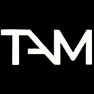

```
tam_website-main/
├── index.html              # Main landing page
├── style.css              # Main stylesheet
├── survival.html          # Survival Showdown event page
├── data.html             # Data Alchemy event page
├── code.html             # Code Cortex event page
├── survival.css          # Event page styles
├── data.css             # Event page styles
├── code.css             # Event page styles
├── images/              # Image assets
│   ├── logo.jpeg
│   ├── survival_logo.PNG
│   ├── data_logo.png
│   ├── code_logo.png
│   └── ...
└── .vscode/             # VS Code configuration
```

---

## 🚀 Overview

The TAM Club Website is a full-stack, modern web application for managing, showcasing, and registering for the flagship events of The AI & ML Club at VIT Vellore. It features a beautiful glassmorphic UI, robust backend with MongoDB, and a seamless experience for both participants and admins.

---

## ✨ Key Features

- **Modern Glassmorphism UI**: Visually stunning, clean, and responsive design across all devices.
- **Event Registration**: Supports both individual and team registrations for multiple events.
- **Admin Panel**: Secure dashboard for viewing, editing, and deleting all registrations.
- **Dynamic Event Pages**: Dedicated pages for Survival Showdown, Data Alchemy, and Code Cortex.
- **Animated Navigation**: Smooth dropdowns, mobile nav, and floating action button.
- **Contact & About Sections**: Easy communication and club information.
- **Robust Validation**: Client and server-side validation for all forms.
- **MongoDB Integration**: All data is stored and managed in a secure NoSQL database.
- **RESTful API**: Clean endpoints for all registration and admin actions.

---

## 🏆 Events

### 1. Survival Showdown
- Team-based escape room challenge
- Problem-solving and collaboration
- Stranger Things themed experience

### 2. Data Alchemy 3.0
- 8-hour machine learning workshop
- Hands-on projects for all skill levels

### 3. Code Cortex 2.0
- 36-hour hackathon
- Multiple tracks: AI/ML, AR/VR, and more
- Team-based project development

---

## 🛠️ Tech Stack

- **Frontend**: HTML5, CSS3, JavaScript (Vanilla), Google Fonts (Inter)
- **Backend**: Node.js, Express.js
- **Database**: MongoDB (Mongoose ODM)
- **Styling**: CSS Grid, Flexbox, Glassmorphism, Responsive Design
- **Other**: Body-parser, CORS, REST API, VS Code recommended settings

---

## 📁 Project Structure

```text
tam_website-main/
├── index.html              # Main landing page
├── style.css               # Main stylesheet
├── server.js               # Node.js/Express backend
├── package.json            # Backend dependencies
├── survival.html           # Survival Showdown event page
├── data.html               # Data Alchemy event page
├── code.html               # Code Cortex event page
├── survival.css            # Survival event styles
├── data.css                # Data Alchemy styles
├── code.css                # Code Cortex styles
├── admin.html              # Admin dashboard
├── register.html           # Data Alchemy registration
├── team_register.html      # Survival registration
├── code_register.html      # Code Cortex registration
├── images/                 # All image assets
│   ├── logo.jpeg
│   ├── survival_logo.PNG
│   ├── data_logo.png
│   ├── code_logo.png
│   └── ...
└── README.md               # This file
```

---

## ⚡ Quick Start

1. **Clone the repository**
   ```bash
   git clone <repository-url>
   cd tam_website-main
   ```
2. **Install backend dependencies**
   ```bash
   npm install
   ```
3. **Start MongoDB** (ensure it's running locally)
4. **Run the backend server**
   ```bash
   node server.js
   ```
5. **Open the frontend**
   - Open `index.html` directly in your browser, or
   - Use a local server (recommended for CORS):
     ```bash
     # Using Python
     python -m http.server 8000
     ```

---

## 🖥️ Screenshots

<p align="center">
  
</p>


---

## 🤝 Contributing

1. Fork this repository
2. Create a new branch (`git checkout -b feature/your-feature`)
3. Commit your changes (`git commit -am 'Add new feature'`)
4. Push to the branch (`git push origin feature/your-feature`)
5. Open a Pull Request

---

## 📬 Contact

- **Email:** mlai@vit.ac.in
- **Address:** VIT University, Vellore, India 632014

---

## ⚖️ License

This project is proprietary and maintained by The AI & ML Club, VIT Vellore. All rights reserved.

